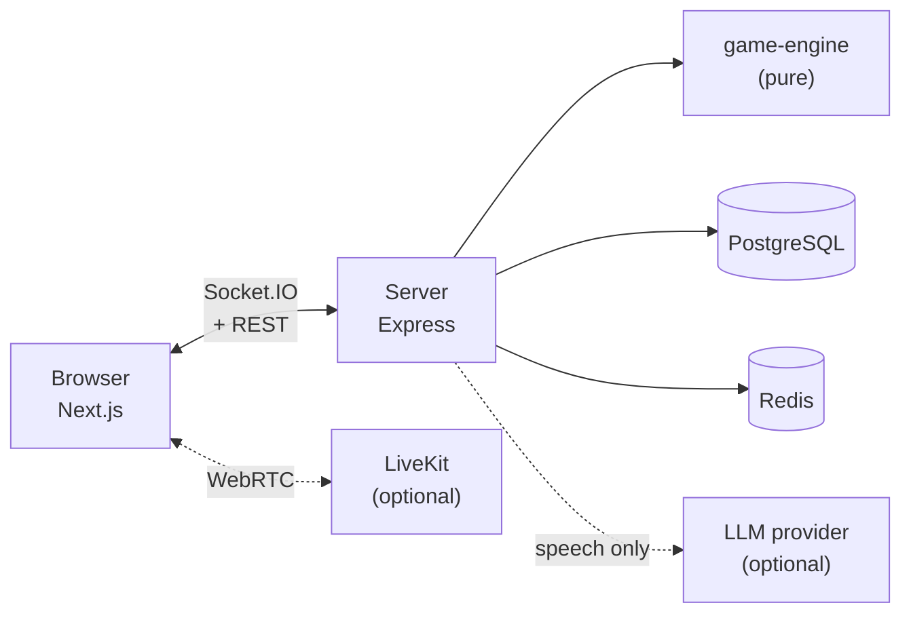

<div align="center">

# 🐺 Ma Sói Online

**A real-time multiplayer Werewolf (Mafia) game — 15 roles, 15 dynamic events, voice chat, and AI bots that actually reason.**

[](https://github.com/kangha23/ma-soi-online/actions/workflows/ci.yml)
[](#testing)
[](https://nodejs.org)
[](https://www.typescriptlang.org)
[](https://nextjs.org)
[](https://socket.io)

[**▶ Play the demo**](https://ma-soi-online-nu.vercel.app) · [**Health check**](https://ma-soi-server-xzhv.onrender.com/api/health) · [**Design docs**](docs/)

</div>

---

> **Note on language.** The game interface is in **Vietnamese** — it is built for Vietnamese players, and role names, chat and all player-facing copy are Vietnamese by design. This README, the code and the source comments' intent are documented in English for contributors.

## Table of contents

- [What this is](#what-this-is)
- [Features](#features)
- [Architecture](#architecture)
- [Quick start](#quick-start)
- [Configuration](#configuration)
- [Game rules](#game-rules)
- [Voice chat](#voice-chat)
- [Bot AI](#bot-ai)
- [Crash recovery](#crash-recovery)
- [API reference](#api-reference)
- [Scripts](#scripts)
- [Testing](#testing)
- [Deployment](#deployment)
- [Security model](#security-model)
- [Known limitations](#known-limitations)

## What this is

A full-stack, production-deployed Werewolf game. Players create a room, share a 5-character code, and play a complete social-deduction match in the browser — with optional daytime voice chat and AI-controlled bots that can fill any empty seat.

The interesting parts are not the CRUD. They are:

- **A pure game engine** (`packages/game-engine`) with no IO dependencies, so the entire rule set is unit-testable and replayable from a seed.
- **A deterministic bot brain** with memory, belief state and per-role strategy. Every bot *decision* is reproducible from a seed; an LLM is used only to phrase what the bot says, never to choose a move.
- **Per-viewer snapshot filtering** — secret roles are stripped server-side before anything reaches a client, so the wire never carries information a player is not entitled to.

## Features

|  | Feature |
|---|---|
| 🎭 | **15 roles** across village, wolves, and three neutrals who each win alone |
| 🎲 | **15 dynamic events** that reshape a round in chaos rooms (Curfew, Blood Moon, Day of Truth, …) |
| ⚖️ | **Balance analyzer** that scores a deck against per-player-count presets and blocks unfair ranked configs |
| 🗳️ | **Two-stage voting** — nomination, defense speech, then a final Hang/Spare trial |
| 🤖 | **AI bots** with deterministic decision-making and LLM-phrased speech, including role claims and counter-claims |
| 🎙️ | **Daytime voice chat** via LiveKit, with server-enforced speaking rights |
| 📱 | **Mobile-first UI** with cinematic phase transitions |
| 🔁 | **Reconnect support** — refresh or drop out and rejoin the same match; a seat abandoned past the grace window is played by the bot brain until its owner returns |
| 📜 | **Full night recap** at game over: every role action, every death, and why |
| 💬 | **Full chat reveal** at game over — the wolves' den and the dead's channel open up once roles are public |
| 🗂️ | **Case file** at game over: 3-5 turning points picked from authoritative match data, with a shareable 9:16 card |
| 🕘 | **Match history** on the home page: your recent games, your role in each, the final roster, and the turning points that decided them |

## Architecture

```
ma-soi-online/
├── apps/
│   ├── web/               # Next.js 16 · React 19 · Tailwind (App Router)
│   └── server/            # Express · Socket.IO · Prisma · Redis
├── packages/
│   ├── game-engine/       # Pure rules + bot brain. No IO. Vitest.
│   └── shared/            # Types, Zod schemas, balance rules, case-file builder, constants
├── docs/                  # Design specs and verification reports
└── docker-compose.yml     # PostgreSQL + Redis for local dev
```

**Dependency direction is strictly one-way:** `web` and `server` both depend on `shared`; `server` additionally depends on `game-engine`. `shared` depends on nothing but Zod, which is why rules needed by *both* the browser and the server (balance scoring, voice permissions, role metadata, case-file construction) live there — a single implementation neither side can drift from.



## Quick start

**Requirements:** Node.js ≥ 20.19 and Docker (for PostgreSQL + Redis).

```bash
# 1. Install dependencies
npm install

# 2. Start PostgreSQL + Redis
npm run dev:infra

# 3. Configure the server
cp .env.example apps/server/.env

# 4. Point the web app at the server
echo "NEXT_PUBLIC_SERVER_URL=http://localhost:4100" > apps/web/.env.local

# 5. Create the database schema
npm run db:migrate
```

Then run the two dev servers in separate terminals:

```bash
npm run dev:server   # http://localhost:4100
```

```bash
npm run dev:web      # http://localhost:3000
```

Open <http://localhost:3000>, enter a nickname, click **Tạo phòng mới** (*Create room*), press **+ Thêm bot** (*Add bot*) until you have 6 players, then **Bắt đầu trận đấu** (*Start match*).

> [!TIP]
> On a clean clone, run `npm run build:deps` before invoking a single workspace directly (e.g. `npm test --workspace @masoi/server`). `@masoi/shared` and `@masoi/game-engine` resolve `main`/`types` to `dist/`, which is gitignored — without it you get a wall of `has no exported member` errors that look like broken code but are just a missing build. The root `npm test` and `npm run lint` handle this for you.

## Configuration

All server configuration is environment-driven. See [`.env.example`](.env.example) for the full annotated list.

### Core

| Variable | Default | Description |
|---|---|---|
| `DATABASE_URL` | — | PostgreSQL connection string (**required**) |
| `REDIS_URL` | `redis://127.0.0.1:6380` | Redis connection string |
| `PORT` / `SERVER_PORT` | `4000` | `PORT` wins; platforms like Render set it automatically |
| `NODE_ENV` | `development` | |
| `CORS_ORIGIN` | `*` | Comma-separated origins, or `*` |

### Anti-abuse

| Variable | Default | Description |
|---|---|---|
| `CHAT_MAX_LENGTH` | `300` | Max characters per chat message |
| `CHAT_RATE_LIMIT_COUNT` | `5` | Messages allowed per window |
| `CHAT_RATE_LIMIT_WINDOW_MS` | `5000` | Chat rate-limit window |
| `SIGNUP_RATE_LIMIT_COUNT` | `10` | Guest registrations per IP per window |
| `SIGNUP_RATE_LIMIT_WINDOW_MS` | `60000` | Signup rate-limit window |
| `TRUST_PROXY` | `1` | Proxy hops to trust. Keep `1` behind Render; set `0` when self-hosting with the port exposed directly, where `X-Forwarded-For` is client-controlled |

### Voice chat (optional)

Leave all three empty to disable voice entirely. Setting only some of them makes the server **fail fast at startup** rather than silently running without voice.

| Variable | Description |
|---|---|
| `LIVEKIT_URL` | `wss://<project>.livekit.cloud` |
| `LIVEKIT_API_KEY` | LiveKit API key |
| `LIVEKIT_API_SECRET` | LiveKit API secret |
| `LIVEKIT_ENV` | Namespace prefix, so `dev` and `prod` rooms never collide |

### Object storage for avatars (optional)

Player avatars are uploaded to any S3-compatible bucket — Cloudflare R2, AWS S3
or MinIO. Leave **all six** variables empty to disable uploads; the game runs
normally on the built-in default avatars. Filling in only *some* of them throws
at startup rather than silently disabling the feature.

| Variable | Purpose |
| --- | --- |
| `OBJECT_STORAGE_ENDPOINT` | S3 API endpoint used for signing |
| `OBJECT_STORAGE_REGION` | `auto` for R2, a real region for S3, anything for MinIO |
| `OBJECT_STORAGE_BUCKET` | Bucket that holds the avatars |
| `OBJECT_STORAGE_ACCESS_KEY_ID` | Access key |
| `OBJECT_STORAGE_SECRET_ACCESS_KEY` | Secret key |
| `OBJECT_STORAGE_PUBLIC_BASE_URL` | Public read URL — **not** the signing endpoint. Must be HTTPS in production. |

Uploads go to `PUT /api/players/me/avatar`. The server sniffs magic bytes
(JPEG/PNG/WebP only — the client-declared MIME type is ignored), auto-rotates
by EXIF, crops to a centred square, resizes to 256×256 and encodes WebP under
200 KB. Object keys are random, so a user's filename never reaches the bucket.

#### Cloudflare R2

1. Cloudflare dashboard → **R2** → **Create bucket**, name it `masoi-avatars`.
2. In the bucket's **Settings**, attach a **custom domain** and use that as
   `OBJECT_STORAGE_PUBLIC_BASE_URL`. Prefer this over the **Public Development
   URL** (`https://pub-<hash>.r2.dev`): Cloudflare rate-limits `r2.dev`
   specifically to discourage production traffic, and it would bite a
   twelve-player room the moment avatars start loading slowly or getting
   throttled. Use `r2.dev` for quick local testing only, never for a deployed
   game.
3. **R2** → **Manage API Tokens** → **Create API Token**, permission
   *Object Read & Write*, scoped to that bucket. Copy the access key ID and
   secret.
4. The token page also shows the S3 endpoint
   `https://<account-id>.r2.cloudflarestorage.com` — that is
   `OBJECT_STORAGE_ENDPOINT`. Set `OBJECT_STORAGE_REGION=auto`.
5. Paste all six values into Render's environment variables and redeploy.

The public URL and the endpoint are different hosts. Using the endpoint as the
public base URL produces avatars that 403 in the browser.

#### MinIO for local development

`npm run dev:infra` already starts MinIO and creates the bucket with public
read access. Copy the object storage block from `.env.example` as-is — it
matches the compose file. The MinIO console is at <http://localhost:9001>
(`masoi` / `masoi_dev_password`).

`http://` public URLs are accepted only when `NODE_ENV` is not `production`.

### Bot AI (optional)

Providers are tried top to bottom. A stage is skipped when any of its parts is missing; if no stage is configured, bots still play — they just use canned phrasing instead of generated speech.

| Variable | Description |
|---|---|
| `BOT_AI_BASE_URL` · `BOT_AI_API_KEY` · `BOT_AI_MODEL` | Any OpenAI-compatible endpoint (include `/v1`) |
| `OPENAI_API_KEY` · `OPENAI_MODEL` | OpenAI, using strict `json_schema` |
| `GEMINI_API_KEY` · `GEMINI_MODEL` | Google AI Studio |
| `BOT_AI_ENABLED` | `false` disables generated speech instantly, no redeploy needed |
| `BOT_AI_MAX_CALLS_PER_GAME` | Cost ceiling shared across the whole provider chain (default `180`) |

Each stage has its own cooldown after a `429`, so exhausting one provider's quota does not stall the others.

## Game rules

### Roles

Village wins by eliminating every wolf. Wolves win once they equal or outnumber everyone else. A neutral role wins on its own condition — for two of the three, without ending the match. See the Neutral section below.

<details open>
<summary><b>Wolf team</b></summary>

| Role | Vietnamese | Ability |
|---|---|---|
| Werewolf | Ma Sói | Collectively choose one victim each night |
| Wolf Cub | Sói Con | Wakes with the pack. When it dies, the pack bites **two** targets the following night |

</details>

<details open>
<summary><b>Village team</b></summary>

| Role | Vietnamese | Ability |
|---|---|---|
| Seer | Tiên Tri | Inspect one player's team each night |
| Apprentice Seer | Tiên Tri Tập Sự | Powerless until the Seer dies, then inherits the inspection |
| Detective | Thám Tử | Check whether two **other** living players are on the same team — it cannot put itself in the pair |
| Guard | Bảo Vệ | Shield one player from every night kill; never itself, and cannot repeat the same target two nights running |
| Guardian Angel | Thiên Thần Hộ Mệnh | Two shields per match against any night kill; never itself, no consecutive repeats |
| Priest | Linh Mục | One vial of holy water: kills a wolf, but backfires and kills the Priest if used on anyone who is not a wolf |
| Witch | Phù Thủy | One heal and one poison, each usable once per match |
| Hunter | Thợ Săn | On death, may shoot one living player — or nobody |
| Mayor | Thị Trưởng | Daytime votes count double |
| Cursed | Kẻ Nguyền Rủa | No night action. Surviving a first wolf bite turns them **into a wolf** |
| Villager | Dân Làng | No ability — discussion and voting only |

</details>

<details open>
<summary><b>Neutral</b></summary>

| Role | Vietnamese | Ability |
|---|---|---|
| Jester | Thằng Hề | No night action. Wins **alone** by getting itself lynched during the day |
| Serial Killer | Sát Nhân | Kills one player each night. Wins **alone** by being the last one standing |
| Executioner | Kẻ Báo Thù | No night action. Wins **alone** if its secret village target is lynched while it is still alive |

`neutral` is a **label, not a faction.** It says only "neither village nor wolves" — the three neutral roles share no win condition and are not on each other's side. `sameFaction()` encodes that: the Detective comparing any two neutrals reads **different**, even though `roleTeam()` returns `"neutral"` for all three. That holds for two players who hold the *same* neutral role too — which is reachable, because an Executioner can turn into a second Jester mid-match.

**Jester.** Wins only by dying to a **lynch verdict** — dying to wolves, a knife, poison, holy water or the Hunter does not count, and surviving to the end is a loss. Its win is a *personal* win: the match keeps going and the overall winner is still decided by the usual rule, and the achievement survives whatever that turns out to be — including a draw.

**Serial Killer.** Strikes alone every night with its own action and its own night state; it never shares the pack's bite or its target. It has no immunity, learns nobody's role, and never sees wolf chat. It may target wolves — it has no allies. Unlike the Jester's, its win is an **overall** outcome that ends the match.

**Executioner.** After the deal, the server draws one **village-team** player as its secret target — never itself, never a wolf, never another neutral — using the injected RNG, so the same seed gives the same target. Only the Executioner learns who it is, and it learns the *identity*, not the role. The target is fixed for the whole match: if that player later becomes a wolf (a bitten Cursed), they are still the target.

It wins the moment its target actually dies to a **lynch verdict**, provided the Executioner is alive at that moment. It does not have to nominate or vote guilty itself. Like the Jester's, the win is a *personal* win recorded under its own condition (`EXECUTIONER_TARGET_LYNCHED`): the match keeps going, there is no "executioner" overall outcome, and the achievement survives the Executioner's own later death and a draw alike.

If the target dies to **anything else** first — a bite, poison, holy water, a Hunter's shot — an Executioner who is still alive and has not already won **turns into a Jester**, and from then on wins only by being lynched itself. Turning grants no win of its own, and no new target is issued. The turn is settled after the whole death batch *and* its Hunter chain resolve, immediately before the match result is checked: if the target and the Executioner fall together, there is no turn, and a Hunter's bullet that lands on the Executioner in the same batch keeps it an Executioner. A win already recorded is never revoked — a lynched Hunter who was the target gets the Executioner its win *before* firing back.

That means a table can hold **two Jesters** at once, one dealt and one turned, and they are still independent: neither wins with the other, and the Detective reads them as different sides. It also means a Jester can appear in a match whose deck had `jester` off.

The Seer reading any neutral role sees **"Phe trung lập"** — neutral team, not the specific role, so it cannot tell the harmless ones from the killer. Holy water thrown at either backfires and kills the Priest, exactly as it would on any non-wolf. A Serial Killer's knife on the Cursed **kills** them: only a valid wolf bite triggers the turn.

All three are **off by default and in no preset deck** — the host has to enable them in a custom deck, and at most one of each may be in play.

</details>

Rooms hold **8–15 players**. Villagers fill whatever seats the configured special roles leave over.

The minimum is 8 because of arithmetic, not taste. Wolves win at `wolves >= everyone else`, and night comes first, so a 6-player table gives the village exactly one wrong lynch before the game is over — and the first vote happens before anyone has learned anything. It is not fixable by deck: every 2-wolf deck at 6 players tops out around 32% for the village in self-play, because the table runs out of seats to put power roles in, while dropping to 1 wolf jumps to 60%. There is nothing in between.

### Win conditions

Evaluated **after** every death and every Hunter reaction has been resolved, in this order:

1. **Nobody alive** → `draw`. It is first because every rule below talks about somebody who is still alive — with an empty table, "no wolves left" is also true, and the village would "win" a match with no villagers in it.
2. **Only the Serial Killer alive** → `serial_killer`.
3. **A Serial Killer alive but not alone** → the match **continues**, whatever the wolf count is. Running out of wolves is not enough for the village while a killer still walks the village, and the wolves do not hold the village while a third party kills both sides every night. One last wolf facing one Serial Killer is a match still in play.
4. **No Serial Killer** → the original two lines, bit for bit: no wolves left is a village win, wolves at parity with everyone else is a wolf win.

The Executioner adds **no branch here at all.** It has no kill, so it counts toward "everyone else" exactly like a Jester: its presence never blocks a village win, and it never holds the village against the pack on its own. What it does add is one step *before* this check — `settleExecutioner()`, the Jester turn — which runs at both places a match result is decided (`checkWinOrContinue` on the server, `finished()` in the self-play harness) and is idempotent, so a phase replayed after a restart never turns anyone twice.

`Winner` therefore has four values plus `null` (match still running). Two of them are not a team: `serial_killer` is one person winning alone, and `draw` is nobody winning — a draw is never recorded as a team win for anyone. Anything reading that field must handle all four, which is why `outcomeName`/`outcomeTeam`/`roleWonOutcome` live in `@masoi/shared` instead of a ternary at each call site.

The balance score deliberately does **not** measure the Serial Killer: it scores a two-sided deck, and a third party that kills every night appears on neither side of that subtraction. Enabling it therefore raises an explicit warning rather than letting a 40–60 score vouch for the deck.

The Executioner is unmeasured too, and raises its **own** warning for a different reason. The part the scale does catch is one lost villager seat (`villagePower` drops by 0.5). The part it misses is larger: a player campaigning all match to hang one specific innocent is a directed pressure on the village that a sum-of-role-powers subtraction has no column for. No self-play batch has measured this role, and the warning says so rather than letting a score stand in for a number nobody has.

### Phase flow

```
LOBBY → ROLE_REVEAL → NIGHT → NIGHT_RESULT → CHECK_WIN
      → DAY_DISCUSSION → VOTING → DEFENSE → FINAL_VOTE → ELIMINATION
      → HUNTER_SHOT? → CHECK_WIN → … → GAME_OVER
```

Countdowns are driven by `phaseEndsAt`, an epoch timestamp issued by the server. Clients only render it — they never decide when a phase ends, and the snapshot carries the server clock so device clock skew cannot desynchronise a match.

### Voting rules

- `VOTING` **nominates** a defendant; it no longer kills anyone directly. Every daytime death goes through `FINAL_VOTE`.
- **Votes are changeable until the deadline.** Only the final choice counts, which is exactly why the voting phase does *not* end early when everyone has voted — ending early would lock in the last voter's click.
- **Nomination ballots are public while you vote.** You see who voted for whom in real time, and afterwards you also see when they switched. Trial Hang/Spare ballots are revealed after the verdict.
- **Displayed counts are head counts; hidden weights only decide.** The Mayor's double vote and the Howl of the Pack bonus vote never show up in a tally, because the ballot list beside it is public — a visible weight would be a subtraction away from outing a hidden role. The same holds for the trial's conviction threshold, which is derived from the electorate's weight.
- A tie eliminates nobody.
- **Dead players' roles stay hidden until `GAME_OVER`** — for humans and bots alike. Death reveals nothing.

### Dynamic events

**Chaos rooms only.** Ranked rooms — the default — run with no events at all, by design.

15 events can fire to reshape a round, each with a beneficiary and a power rating the balance analyzer accounts for:

`CURFEW` · `SILENT_NIGHT` · `AMNESTY_DAY` · `CLEARING_MIST` · `PEACEFUL_NIGHT` · `JUDGMENT_DAY` · `LAST_STAND` · `DAY_OF_TRUTH` · `MOONLESS_NIGHT` · `BLOODY_HUNT` · `HOWL_OF_THE_PACK` · `BLOOD_MOON` · `WOLF_SHADOW` · `MORNING_REPORT` · `DEAD_CAN_SPEAK`

## Voice chat

Disabled by default. The host toggles it in the lobby, and the toggle only appears when the server has LiveKit credentials.

**Daytime only.** Wolves at night and the dead still coordinate over text. This is a design decision, not a temporary gap: during the day no channel carries secret information — who died and who stands accused are both public — so "who is allowed to speak" reveals nobody's role. That lets each room use exactly **one** LiveKit room with no leakage surface in the signaling layer.

| Phase | Who may speak |
|---|---|
| `LOBBY`, `GAME_OVER` | Everyone |
| `DAY_DISCUSSION`, `VOTING`, `FINAL_VOTE`, `NIGHT_RESULT`, `ELIMINATION` | The living |
| `DEFENSE` | The defendant only |
| `NIGHT`, `ROLE_REVEAL`, `HUNTER_SHOT` | Nobody |

The dead can always **listen**, but cannot speak until `GAME_OVER`.

Each player picks their own mic mode (stored in `localStorage` — it is an input preference, not a room rule): `ptt` (hold to talk, the default) or `toggle` (tap on, tap off, far friendlier on phones). Push-to-talk is the default deliberately: in a game where one careless sentence loses the match, "you must actively hold it" is the safer default.

> [!WARNING]
> Two invariants to preserve if you touch this code:
>
> 1. **Tokens never carry speaking rights.** Every issued token has `canPublish: false`; permission arrives only via `updateParticipant` after joining. That is what makes replaying an old token after dying useless. Do not "optimise" by baking the grant into the token.
> 2. **`canPublishData` defaults to `true` in LiveKit.** The adapter closes it explicitly. Removing that line reopens an unguarded data channel that bypasses `resolveChat` entirely.

Full design: [`docs/superpowers/specs/2026-08-30-voice-chat-design.md`](docs/superpowers/specs/2026-08-30-voice-chat-design.md). Verify real credentials with `npm run voice:probe`.

## Bot AI

**Every bot decision is deterministic.** Night actions, nominations, Hang/Spare ballots and Hunter shots all come from a decision engine with memory, belief state and per-role strategy — reproducible from a seed. `BotBrain` has no signature that returns a move.

**The LLM only phrases speech.** Missing `GEMINI_API_KEY` or a blown quota makes bots fall back to canned lines; it does not change a single move.

Bots can claim roles in chat (a Seer announcing a wolf hit, a wolf claiming falsely, counter-claim scenes), and the village weighs claims using four public signals. See [`docs/bot-ai-phase-5-verification.md`](docs/bot-ai-phase-5-verification.md).

<details>
<summary><b>Honest limitations of the bot conversation layer</b></summary>

- A Guard genuinely covering a real Seer reads identically to a bluff. Deliberately unpatched — patching it would require leaking who was protected.
- The claim parser misses phrasings real players actually type (regional slang, abbreviations).
- Within a wolf pack, the same seat always steps up to bluff.
- Because the game never reveals dead players' roles, the village has no anchor to confirm a claim against.
- **The final gate — a human reading a full match and judging conversation quality — has not been run.** Every number currently available measures statistical behaviour through self-play, not perceived quality.

</details>

Run a self-play batch with `npm run selfplay`, or probe a live provider with `npm run bot:probe`.

## Crash recovery

A backend restart no longer ends the match. Every authoritative state transition
writes a versioned snapshot to Redis (`room:{CODE}`); when a player reconnects,
the room is validated with Zod, rebuilt, and resumed — same round, same phase,
same votes, same bot memories, same clock.

Three details carry most of the weight:

- **No timer handle is ever persisted.** What gets stored is the *pending step*
  — a name plus an absolute `runAt` — so a fresh process knows what the match is
  waiting for without having to infer it from the phase. Inferring would break
  on night, where one `NIGHT` phase has two stages.
- **A phase token guards every transition** (`round:phase:phaseSeq`). A step
  carrying a stale token is a step from a situation that no longer exists, so it
  is dropped. This is what makes "no phase and no side effect runs twice" a
  structural property rather than a hope — it holds for the leftover timer, the
  re-armed timer, and the deadline catch-up alike.
- **Bot RNG stores a cursor, not a state.** The generator is counter-based, so
  one integer reopens the exact stream. Bots therefore do not change their minds
  just because the process died.

A snapshot that fails validation is **quarantined**, never guessed at: the key
is moved aside for 24 hours, a structured `snapshot.invalid` line is logged, and
the player is told plainly. Redis being unreachable is kept distinct from the
room not existing — one asks the player to retry and changes nothing, the other
cleans up.

Operational details — keys, TTLs, log lines, deploy checklist, when to bump
`persistenceVersion` — are in [`docs/operations-recovery.md`](docs/operations-recovery.md).

## API reference

### REST

| Method | Path | Body | Response | Notes |
|---|---|---|---|---|
| `POST` | `/api/players` | `{ nickname }` | `{ playerId, token, nickname }` | Guest registration. The client keeps the token; the server stores only its SHA-256. Rate-limited per IP. |
| `GET` | `/api/players/me/matches` | — | `{ matches: MatchHistoryEntry[] }` | The caller's 20 most recent finished matches, each with its stored case file when one exists. Requires `Authorization: Bearer <token>`; answers `401` without a valid one. Matched by player id inside the stored roster, so games recorded before ids were stored do not appear. |
| `PUT` | `/api/players/me/avatar` | `multipart/form-data`, field `file` | `{ avatarUrl }` | Bearer auth. ≤ 5 MB. Format is decided by magic bytes (JPEG/PNG/WebP), never by the client-declared MIME type. The server auto-rotates by EXIF, crops to a centred square, resizes to 256×256 and encodes WebP under 200 KB. `503` when object storage is not configured. |
| `DELETE` | `/api/players/me/avatar` | — | `204` | Bearer auth. Clears the avatar and deletes the stored object. Succeeds even when object storage is not configured — the database is the source of truth for "has an avatar". |
| `GET` | `/api/health` | — | `{ ok, db, redis, version, startedAt }` | `503` when PostgreSQL is down. Redis trouble reports `redis: false` but still returns `200`, since in-memory rooms remain playable. |

`version` is the first 7 characters of the running commit (from `RENDER_GIT_COMMIT`), or `dev` outside a deploy environment — compare it against `git rev-parse --short HEAD` to confirm what is actually live.

### Socket.IO

Connect with `io(SERVER_URL, { auth: { playerId, token } })`. Every payload is Zod-validated with `.strict()`.

<details>
<summary><b>Client → Server</b></summary>

| Event | Payload | Requires |
|---|---|---|
| `room:create` | `{}` | — |
| `room:join` | `{ code }` | Unique nickname; must leave any current room; cannot join a match in progress |
| `room:leave` | `{}` | Membership |
| `room:set-ready` | `{ ready }` | Member, outside a match |
| `room:kick` | `{ targetId }` | Host, before start |
| `room:update-config` | `{ config }` | Host, outside a match |
| `room:add-bot` | `{}` | Host, outside a match |
| `room:update-avatar` | `{ avatarUrl: null }` | Member; removal only. Uploads go through `PUT /api/players/me/avatar` — sending image data over Socket.IO is what bloated every room snapshot. Kept so older cached clients can still remove an avatar. |
| `room:start` | `{}` | Host; ≥ 6 players, valid config, all humans ready |
| `room:reset` | `{}` | Host after `GAME_OVER` → back to lobby |
| `game:action` | `{ type, targetId?, targetId1?, targetId2? }` | Correct role, alive, during `NIGHT` |
| `game:vote` | `{ targetId }` | Alive, during `VOTING`. `null` means *nobody* — a deliberate choice, not a blank |
| `game:final-vote` | `{ guilty }` | Alive, not the defendant, during `FINAL_VOTE` |
| `game:hunter-shot` | `{ targetId }` | The Hunter, during `HUNTER_SHOT` |
| `game:skip-discussion` | `{}` | Alive, during `DAY_DISCUSSION`; unanimous consent ends the phase |
| `game:day-of-truth-claim` | `{ role }` | During the `DAY_OF_TRUTH` event |
| `game:dead-message` | `{ text }` | The chosen ghost, during `DEAD_CAN_SPEAK` |
| `chat:send` | `{ text }` | Channel chosen server-side from phase and alive state |
| `voice:token` | `{}` | Human member, voice enabled, LiveKit configured |
| `voice:ready` | `{}` | Signals the LiveKit room was joined, so the server can grant phase-appropriate rights |

`game:action` types: `KILL` · `SEE` · `GUARD` · `HEAL` · `POISON` · `SKIP` · `DETECTIVE_CHECK` · `GUARDIAN_PROTECT` · `HOLY_WATER`

</details>

<details>
<summary><b>Server → Client</b></summary>

| Event | Payload | Notes |
|---|---|---|
| `room:snapshot` | `RoomSnapshot` | Personalised per recipient — secrets are filtered before sending |
| `chat:new` | `ChatMessage` | Delivered only to players entitled to that channel |
| `voice:token` | `{ url, token, roomName }` | A server event rather than an ack, because the `handler` helper in `ws.ts` takes exactly one argument |
| `error` | `{ message }` | Business-rule errors, in Vietnamese |

</details>

## Scripts

| Command | Description |
|---|---|
| `npm run dev:infra` | Start PostgreSQL + Redis via Docker |
| `npm run dev:server` | Server in watch mode |
| `npm run dev:web` | Next.js dev server |
| `npm run build` | Build shared → engine → server → web |
| `npm run build:deps` | Build only `shared` → `engine` (enough for tests and lint) |
| `npm test` | Full suite across all three packages |
| `npm run lint` | Typecheck every workspace |
| `npm run db:migrate` | `prisma migrate deploy` |
| `npm run db:generate` | `prisma generate` |
| `npm run selfplay` | Run bot self-play batches and print a report. Add `--traces <dir>` to dump per-decision JSONL for the first few games |
| `npm run trace-view` | Read a self-play trace file as a per-bot timeline — what moved each belief, which scoring terms decided each vote, why a bot spoke. See [`docs/bot-tuning-workflow.md`](docs/bot-tuning-workflow.md) |
| `npm run role-power` | Measure each role's marginal win-rate contribution by paired self-play, to recalibrate `ROLE_POWER` |
| `npm run bot:probe` | One real LLM call against a fake match, to validate keys and prompts |
| `npm run voice:probe` | One real LiveKit round trip, to validate credentials and token grants |
| `npm run test:e2e` | Socket.IO smoke test; needs a running local server. Not yet a release gate |
| `npm run test:e2e:recovery` | Starts a server, SIGKILLs it mid-match, restarts it, and asserts the match resumes. Needs `dev:infra` |

## Testing

| Package | Runner | Tests |
|---|---|---|
| `@masoi/shared` | Vitest | **97** |
| `@masoi/game-engine` | Vitest | **1534** |
| `@masoi/server` | Vitest | **861** |
| `@masoi/web` | `node:test` | **937** |
| | | **3429 total** |

Every package typechecks its tests as well as its sources — `npm run lint` runs `tsc` over both. This matters more than it sounds: the server's tests were unchecked until recently, and in that gap more than forty fixtures drifted away from the types they claimed to build, several of them still setting engine fields that had been renamed away.

The engine suite includes seeded self-play runs that assert invariants across hundreds of full matches — no illegal move is ever accepted, no bot ever learns a role it should not know, and the same seed reproduces a match bit-for-bit.

```bash
npm test                                  # everything
npm test --workspace @masoi/game-engine   # one package (run build:deps first)
```

## Deployment

The live setup is **Vercel (web) → Render (server) → Neon (PostgreSQL) + Upstash (Redis)**.

> [!IMPORTANT]
> Run the backend as a **single instance**. Live match state is held in memory, with Redis as a write-through copy used for room recovery. Scaling horizontally will split players across processes that cannot see each other's rooms.

<details>
<summary><b>Step-by-step deployment</b></summary>

**1 · Neon PostgreSQL** — create a project, copy the **pooled** connection string. It becomes `DATABASE_URL` on Render. Never commit it or add it to Vercel.

**2 · Upstash Redis** — create a database in the region closest to the backend and copy the TLS string (`rediss://`). It becomes `REDIS_URL` on Render.

**3 · Render backend** — create a **Web Service** from this repository using the Docker environment, branch `main`, and `Dockerfile.server`. Use one instance and set the health check path to `/api/health`; Render provides `PORT` automatically. Set at minimum:

```bash
DATABASE_URL=<Neon pooled connection string>
REDIS_URL=<Upstash rediss:// string>
NODE_ENV=production
CORS_ORIGIN=https://YOUR-PROJECT.vercel.app
```

Container start runs `prisma migrate deploy` before opening the port. Note the resulting HTTPS origin.

**4 · Vercel frontend** — import the same repository, keep the root directory at the repo root (`vercel.json` already contains the monorepo build command), and set `NEXT_PUBLIC_SERVER_URL` to the Render origin **without** a trailing slash. Deploy, then go back to Render and set `CORS_ORIGIN` to the exact Vercel origin and redeploy.

**5 · Verify** — `https://<backend>/api/health` should return `200` with `{ "ok": true, "db": true, "redis": true }`. Then open the frontend, create a room, add bots, and confirm the socket connects.

</details>

CI runs build → test → lint on every push and pull request, and deploys previews to Vercel. Render Free instances sleep when idle, so the first request after a quiet period is slow. If the backend restarts mid-match, rooms are returned to the lobby safely rather than resuming half-finished timers.

## Security model

**The server is the single source of truth.** Nothing about the game state is trusted from a client.

- Secret roles are filtered inside `snapshotFor(viewerId)` **before** serialization, so the wire never carries a role the viewer is not entitled to see.
- Private chat (wolves, the dead) is emitted only to the exact set of entitled recipients — it is not broadcast and filtered client-side. It opens to everyone at `GAME_OVER`, and only there, because that is the same phase in which the engine reveals every role.
- Every socket payload is validated with strict Zod schemas; unknown keys are rejected.
- Session tokens are stored as SHA-256 hashes; the plaintext token exists only on the client.
- Stored match history is filtered element by element on read. A `Json` column keeps the shape the build that wrote it chose, so a role later renamed or removed would otherwise reach `ROLE_META[role].team` as `undefined` and take down the home page for whoever played it — permanently, since the data lives in the database.
- Voice speaking rights are granted after joining, never encoded in a token, so an old token cannot restore a dead player's mic.
- A kicked player is recorded on the room and refused on re-entry. Without that the kick only removed them from the member list once, and the next `join` — a page refresh — put them straight back into the lobby they were just removed from.
- Guest signup is rate-limited per IP. This one matters more than it looks: every socket rate limit is keyed by `playerId`, so unlimited free `playerId`s would have made all of them decorative.

## Known limitations

Stated plainly, because knowing where the edges are is more useful than pretending they do not exist.

- **Single instance only.** Room state lives in RAM; Redis is a recovery copy. There is no distributed lock, so two processes serving the same room code would fight over it — the `opSeq` compare-and-set limits the damage but does not solve it.
- **Recovery is best-effort on the Redis side.** If Redis is down *at the moment* the process dies, the match is lost. That is a deliberate trade: a slow Redis must never stall a live table.
- **Rooms wake up lazily**, when someone reconnects. A match left with only bots stays frozen until a human returns or the 6-hour TTL expires.
- **LLM speech is not replayed.** After a restore, bots say new sentences; only their *decisions* are deterministic.
- **No chat persistence.** Match history records the result, the final roster and the case file, not the conversation. The end-of-match reveal reads the room's in-memory log, which is capped at the last 100 messages across all channels, so a long and talkative game reveals its final stretch rather than the whole thing.
- **Case files only exist from the match that introduced them onward.** Games finished before the column was added show their roster but no turning points; the ingredients live only in the room's memory, so they cannot be reconstructed after the fact.
- **Voice is daytime-only** and audio-only — no video.
- **Rate limiting is in-memory**, so it is per-process and resets on deploy.
- **The bot conversation layer has not passed a human quality review** — see the expandable section under [Bot AI](#bot-ai).

## Documentation

Design specifications and verification reports live in [`docs/`](docs/) — including the bot AI phase reports, the roles and events balance design, the voice chat spec, and the [crash recovery runbook](docs/operations-recovery.md).

---

<div align="center">
<sub>Built with TypeScript, and an unreasonable number of tests.</sub>
</div>
